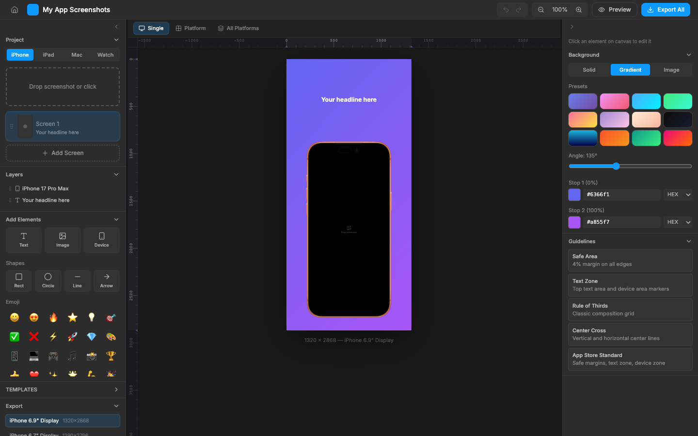

# App Store Screenshot Editor

A browser-based visual editor for designing App Store and Play Store screenshots, plus a full **App Icon Generator** for all Apple platforms. Built with React, TypeScript, and Tailwind CSS.

**[Live Demo](https://husseinhj.github.io/app-store-screenshot-editor/)**



## Features

### Screenshot Editor
- **Multi-Platform Support** — Design screenshots for iPhone, iPad, Mac, and Apple Watch
- **Device Mockups** — Realistic device frames (iPhone 16 Pro, iPad Pro, MacBook, Apple Watch Ultra, and more)
- **Canvas Editor** — Drag-and-drop elements with snap guides, rulers, and alignment tools
- **Rich Text** — Full text formatting with fonts, colors, shadows, glow, gradients, and stroke effects
- **Templates** — Pre-built templates to get started quickly (Minimal, Bold, Editorial, Glass Morphism, and more)
- **Backgrounds** — Solid colors, gradients, and image backgrounds with presets
- **Shapes & Emoji** — Rectangles, circles, lines, arrows, and emoji elements with backdrop blur
- **Element Grouping** — Figma-style group/ungroup with double-click to enter groups
- **Layers Panel** — Drag-to-reorder, visibility toggle, lock, and group management
- **App Store Preview** — Full-screen simulation of how screenshots appear on the actual App Store
- **Batch Export** — Export individual screenshots or all platforms as ZIP

### App Icon Generator
- **All Apple Platforms** — iOS, iPadOS, macOS, watchOS, and visionOS
- **Interactive Canvas** — Drag, resize, and position elements directly on a 1024×1024 canvas
- **Design Guidelines** — Built-in overlays for Apple safe zones, grid, and circle-safe guides
- **Padding & Spacing Controls** — Quick padding slider, center, and fill-to-canvas actions
- **Platform Previews** — Live previews with correct masks (squircle for iOS/macOS, circle for watchOS/visionOS)
- **Xcode-Ready Export** — Exports a ZIP with `AppIcon.appiconset` folder and `Contents.json`, ready to drag into Xcode

### General
- **Undo/Redo** — Full history with keyboard shortcuts
- **Persistent Projects** — Auto-saved to localStorage with multi-project support
- **PWA Support** — Installable as a standalone app with offline caching

## Getting Started

```bash
# Install dependencies
npm install

# Start development server
npm run dev

# Build for production
npm run build
```

## Tech Stack

- **React 19** + TypeScript
- **Tailwind CSS v4** with custom dark theme
- **Zustand** + Immer for state management (with temporal undo/redo)
- **Vite** for building and dev server
- **Tiptap** for rich text editing
- **Lucide** for icons
- **JSZip** + html2canvas-pro for export

## Keyboard Shortcuts

| Shortcut | Action |
|----------|--------|
| `Cmd/Ctrl + Z` | Undo |
| `Cmd/Ctrl + Shift + Z` | Redo |
| `Cmd/Ctrl + A` | Select all elements |
| `Cmd/Ctrl + C / V` | Copy / Paste elements |
| `Cmd/Ctrl + Shift + P` | Toggle App Store Preview |
| `Delete / Backspace` | Remove selected elements |
| `Escape` | Deselect / Exit group / Close preview |

## License

MIT
